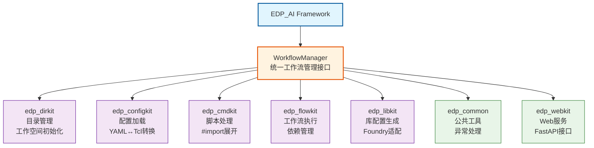

# EDP_AI 框架介绍

[← 返回目录](../TUTORIAL.md)

## 这是什么？

**EDP_AI** 是一个专为芯片设计流程管理而设计的框架，帮助工程师更高效地管理复杂的 EDA 工作流。

### 核心价值

- **统一管理**：将分散的脚本、配置、流程统一管理
- **自动化**：自动处理依赖关系、配置合并、脚本展开
- **可扩展**：通过 Hooks 机制轻松扩展和定制
- **标准化**：统一的目录结构、配置格式、工作流规范

### 适用场景

- **芯片设计团队**：管理多个项目、多个版本、多个用户的工作流
- **EDA 流程开发**：快速开发和部署新的 EDA 流程
- **配置管理**：统一管理不同项目、不同流程的配置
- **脚本复用**：通过模块化设计实现脚本的复用和共享

---

## 架构概览

EDP_AI 框架由七个核心模块组成，每个模块负责不同的功能：


<!-- Mermaid代码用于将来更新图片，请勿删除


PNG生成命令：
```bash
mmdc -i architecture_diagram.mmd -o edp_center/docs/images/architecture_diagram.png -t default -b white
```
-->

**架构图说明：**
- **蓝色节点**：EDP_AI框架总入口
- **橙色节点**：WorkflowManager统一管理接口
- **紫色节点**：核心功能模块（dirkit, configkit, cmdkit, flowkit, libkit）
- **绿色节点**：辅助工具模块（common, webkit）

**核心模块功能：**
- **edp_dirkit**：目录管理、工作空间初始化
- **edp_configkit**：配置加载、YAML↔Tcl格式转换
- **edp_cmdkit**：脚本处理、#import指令展开、Hooks机制
- **edp_flowkit**：工作流执行、依赖关系管理
- **edp_libkit**：库配置文件生成、Foundry适配
- **edp_common**：公共工具、统一异常处理、日志系统
- **edp_webkit**：Web服务、FastAPI接口、指标监控

### 七个核心模块

1. **edp_dirkit** - 目录管理和工作空间初始化
   - 创建项目目录结构
   - 初始化用户工作空间
   - 管理分支

2. **edp_configkit** - 配置文件的加载、合并和转换
   - 多层级配置加载（common → project → user）
   - YAML ↔ Tcl 格式转换
   - 配置合并和覆盖

3. **edp_cmdkit** - Tcl 脚本处理
   - 展开 `#import` 指令
   - 处理 Hooks（step.pre, step.post, sub_step.pre/post/replace 等）
   - 生成最终可执行的脚本

4. **edp_flowkit** - 工作流执行和依赖管理
   - 解析 `dependency.yaml` 建立依赖图
   - 自动发现跨 flow 依赖
   - 按依赖顺序执行步骤

5. **edp_libkit** - 库配置生成工具
    - 从分散的库文件中收集配置信息
    - 生成统一的 `lib_config.tcl` 配置文件
    - 支持多种 foundry（Samsung、SMIC、TSMC）和库类型（STD、IP、MEM）
    - 支持批量处理和版本管理

6. **edp_common** - 公共工具模块
    - 统一的异常处理系统（EDPError体系）
    - 错误处理装饰器和上下文管理器
    - 日志记录辅助函数
    - 通用工具函数

7. **edp_webkit** - Web服务和界面模块
    - 基于FastAPI的Web服务
    - 指标收集和监控接口
    - Web界面支持（开发中）
    - RESTful API接口

---

## 工作流程图

执行 `edp -run` 命令时的完整流程：

```
                    ┌─────────────────────────────────────┐
                    │      User Command                   │
                    │   edp -run pv_calibre.ipmerge       │
                    └─────────────────┬───────────────────┘
                                      │
                                      ▼
                    ┌─────────────────────────────────────┐
                    │  1. edp_dirkit: Init Workspace      │
                    │     • Check directory structure     │
                    │     • Create missing directories    │
                    └─────────────────┬───────────────────┘
                                      │
                                      ▼
                    ┌─────────────────────────────────────┐
                    │  2. edp_configkit: Load Config      │
                    │     • Load common config            │
                    │     • Load project config           │
                    │     • Load user config (highest)    │
                    │     • Merge config → full.tcl       │
                    └─────────────────┬───────────────────┘
                                      │
                                      ▼
                    ┌─────────────────────────────────────┐
                    │  3. edp_flowkit: Parse Deps         │
                    │     • Read dependency.yaml          │
                    │     • Build dependency graph        │
                    │     • Check prerequisite steps      │
                    └─────────────────┬───────────────────┘
                                      │
                                      ▼
                    ┌─────────────────────────────────────┐
                    │  4. edp_cmdkit: Process Script      │
                    │     • Expand #import directives     │
                    │     • Insert Hooks                  │
                    │     • Generate script → cmds/xxx.tcl│
                    └─────────────────┬───────────────────┘
                                      │
                                      ▼
                    ┌─────────────────────────────────────┐
                    │  5. edp_flowkit: Execute Command    │
                    │     • Local exec or LSF submit      │
                    │     • Record run status             │
                    │     • Update .run_info              │
                    └─────────────────┬───────────────────┘
                                      │
                                      ▼
                              ┌───────────────┐
                              │    Complete!  │
                              └───────────────┘
```

---

## 主要特性

### 1. 多层级配置管理

配置文件按优先级从低到高加载，后加载的配置会覆盖先加载的：

```
common/main/config.yaml          (最低优先级)
    ↓
common/{flow}/config.yaml
    ↓
{project}/main/config.yaml
    ↓
{project}/{flow}/config.yaml
    ↓
user_config.yaml                 (最高优先级)
```

### 2. 自动依赖管理

系统自动解析 `dependency.yaml`，建立步骤之间的依赖关系：

```
pnr_innovus.init
    ↓
pnr_innovus.place
    ↓
pnr_innovus.postroute
    ↓
pv_calibre.ipmerge
```

### 3. 模块化脚本设计

通过 `#import` 指令实现脚本的模块化：

```tcl
#import source helper.tcl      # 加载 proc 定义
# 直接写散装代码，或使用 #import source 加载 proc 定义
```

### 4. Hooks 扩展机制

在脚本执行前后插入自定义代码：

```
step.pre  →  主脚本  →  step.post
```

---

## 快速预览

一个最简单的使用示例：

```bash
# 1. 初始化项目
edp_init -init -prj dongting -v P85 --block block1 --user user1

# 2. 运行流程
cd /path/to/work/dongting/P85/block1/user1/main
edp -run pv_calibre.ipmerge
```

就这么简单！框架会自动处理：
- ✅ 加载和合并配置
- ✅ 解析依赖关系
- ✅ 处理脚本和 Hooks
- ✅ 执行命令并记录状态

---

## 下一步

- 📦 [安装 EDP_AI 框架](01_installation.md)
- 🚀 [快速开始你的第一个项目](02_getting_started.md)

[← 返回目录](../TUTORIAL.md)

